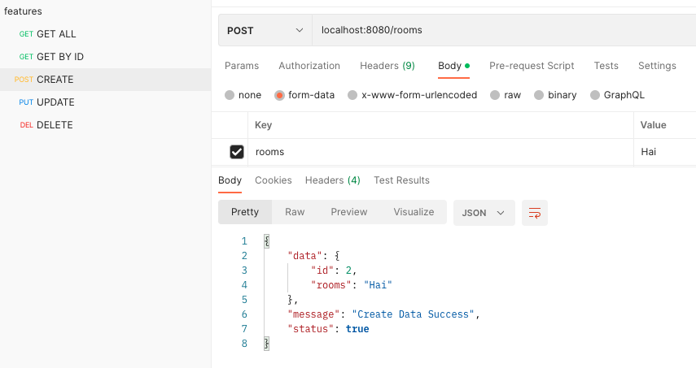

# mvcGo
<div align="center">
  <a href="images/logo.png">
    
  </a>
</div>

## 💫 About
Inspired by Laravel, we aim to automate feature creation to make it faster and easier. Our approach includes using the MVC architecture with the Echo framework, Gorm, and other tools. 

Our goal is to make it possible to create CRUD features in less than one minute. Additionally, a `Dockerfile`, `.gitignore` will also be generated.

## 🚀 Import
```shell
go get -u github.com/findryankp/mvcGo@latest
```

## 👨🏽‍💻 Step By Step
1. First step, add this syntax to your `main function` in `main.go` file
```go
mvcGo.Init()
```
* for example :
<div align="center">
  <a href="images/01.png">
    
  </a>
</div>

2. Run this syntax in cmd/terminal
```shell
go run . init
```

3. If successful, the following files will be generated:
* Database configuration files
* Middleware files (including JWT authentication, logging, and CORS)
* User authentication files (for login and registration)
* Environment files (.env) and Dockerfile
* And more
<div align="center">
  <a href="images/02.png">
    
  </a>
</div> 

4. Set `.env` with your own configuration database
<div align="center">
  <a href="images/env.png">
    
  </a>
</div>

## 🚀 Create new feature
* run this syntax in your cmd/terminal
```shell
go run . features FeaturesNames
```
* ex : `go run . features Rooms`
* CRUD controller, model, route, and migratiton feature from your FeatureNames will be created
<div align="center">
  <a href="images/03.png">
    
  </a>
</div>

## 🎯 Run Project
```shell
go run .
```

* Try it with your postman or another
<div align="center">
  <a href="images/05.png">
    
  </a>
</div>

## 😎 Development by
[](https://github.com/findryankp)
[](https://www.linkedin.com/in/Findryankp/)
