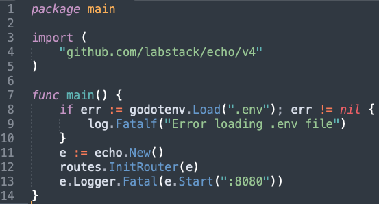
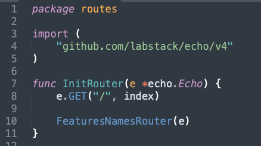

# mvcGo
Inspired by laravel to automate feature creation to make it faster and easier

**Development by:** 
- Findryankp

## Import
```shell
go get -u github.com/Findryankp/mvcGo
```

## Initialization
1. Init mvcGo on your projects
```shell
go run mvcGo init
```

2. Set .env with your own configuration database

<div align="left">
  <a href="https://github.com/othneildrew/Best-README-Template">
    
  </a>
</div>

### Add this to your function main
- to load environment file and run the project with **ECHO**
```go
if err := godotenv.Load(".env"); err != nil {
    log.Fatalf("Error loading .env file")
}
e := echo.New()
routes.InitRouter(e)
e.Logger.Fatal(e.Start(":8080"))
```
for example :
<br/>
<div align="left">
  <a href="https://github.com/othneildrew/Best-README-Template">
    
  </a>
</div>

## Create new feature
1. run this in your cmd
```shell
go run mvcGo features FeaturesNames
```
ex : go run mvcGo features Products

2. set and add to routes/initRouter file with your features
```go
FeaturesNamesRouter(e)
```
<div align="left">
  <a href="https://github.com/othneildrew/Best-README-Template">
    
  </a>
</div>