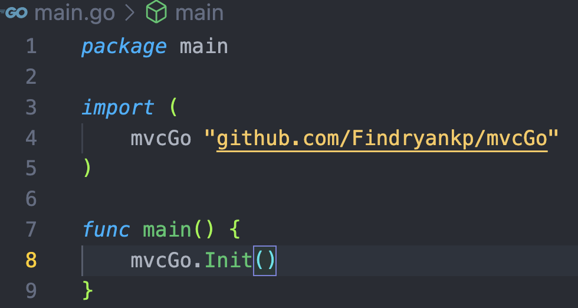
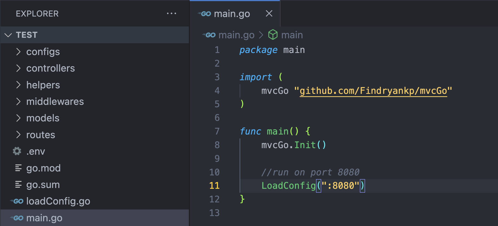
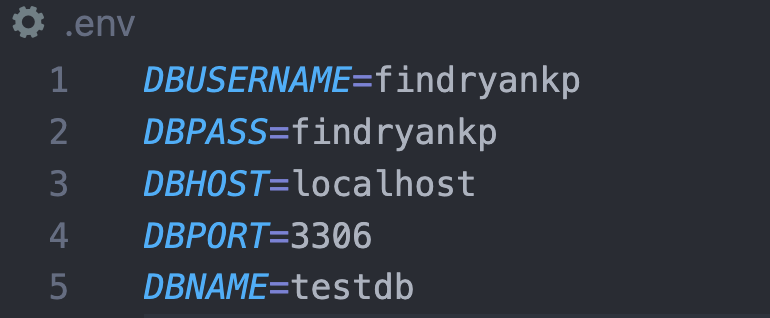
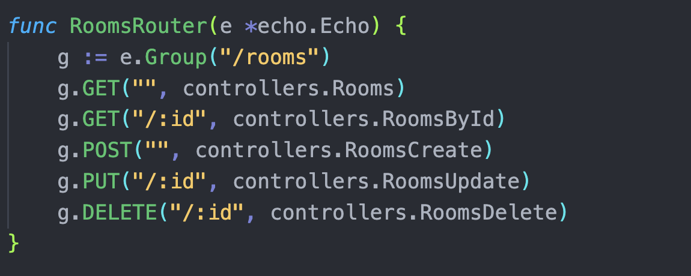
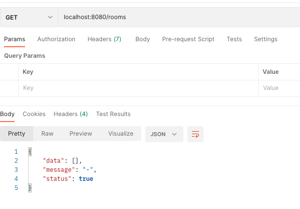

# mvcGo
Inspired from laravel to automate feature creation to make it faster and easier.

**Development by:** 
- Findryankp

## Import
```shell
go get -u github.com/Findryankp/mvcGo@latest
```

## Step By Step
1. First step, add this to your **main** function
```go
mvcGo.Init()
```
for example :
<br/>
<div align="left">
  <a href="https://github.com/othneildrew/Best-README-Template">
    
  </a>
</div>

2. Run this syntax in cmd
```shell
go run . init
```

3. If success, files thats are generated are :
* configs database
* middlewares (jwt auth, logs, cors)
* user auth (login, register)
* environment (.env)
<div align="left">
  <a href="https://github.com/othneildrew/Best-README-Template">
    
  </a>
</div>  
<br/>

4. Set .env with your own configuration database

<div align="left">
  <a href="https://github.com/othneildrew/Best-README-Template">
    
  </a>
</div>

## Create new feature
run this in your cmd
```shell
go run . features FeaturesNames
```
ex : go run mvcGo features Rooms

* CRUD controller, model, route, and migratiton feature from your FeatureNames will be created
<div align="left">
  <a href="https://github.com/othneildrew/Best-README-Template">
    
  </a>
</div>

### Run Project
```shell
go run .
```

try it with your postman or another
<div align="left">
  <a href="https://github.com/othneildrew/Best-README-Template">
    
  </a>
</div>
